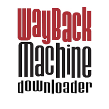

 
# Wayback Machine Downloader
A C# implementation of wayback machine downloader.  Download an entire archived website from the [Internet Archive Wayback Machine](http://web.archive.org/).  The files downloaded are the original ones not the Wayback Archive rewritten version.

If you prefer the flat version of this documentation [this way here.](https://github.com/erlange/wbm-dl/README.flat.md)

## Wiki Table of Contents (Wiki)

* 📁[**Home**](https://github.com/erlange/wbm-dl/wiki)
* 📁[**Requirements**](https://github.com/erlange/wbm-dl/wiki/02.-Requirements#requirements)
* 📂[**Installation**](https://github.com/erlange/wbm-dl/wiki/03.-Installation#installation)
  * 📄[Stand Alone Exexutable](https://github.com/erlange/wbm-dl/wiki/03.-Installation#Stand-Alone-Exexutable)
  * 📄[Source Code](https://github.com/erlange/wbm-dl/wiki/03.-Installation#Source-Code)
* 📂[**Basic Usage**](https://github.com/erlange/wbm-dl/wiki/04.-Basic-Usage#basic-usage)
  * 📄[Specifying the URL to Download](https://github.com/erlange/wbm-dl/wiki/04.-Basic-Usage#specifying-the-url-to-download)
  * 📄[Output Directory](https://github.com/erlange/wbm-dl/wiki/05.01.-Output-Directory#output-directory)
* 📂[**Advanced Usage**](https://github.com/erlange/wbm-dl/wiki/05.-Advanced-Usage#advanced-usage)
  * 📄[Case Sensitive Parameter Names](https://github.com/erlange/wbm-dl/wiki/05.-Advanced-Usage#case-sensitive-parameter-names)
  * 📄[Downloading Snapshots for All Timestamps](https://github.com/erlange/wbm-dl/wiki/05.02.-Downloading-Snapshots-for-All-Timestamps#downloading-snapshots-for-all-timestamps)
  * 📄[From Timestamp](https://github.com/erlange/wbm-dl/wiki/05.03.-From-Timestamp#from-timestamp)
  * 📄[To Timestamp](https://github.com/erlange/wbm-dl/wiki/05.04.-To-Timestamp#to-timestamp)
  * 📄[Limiting Between Two Timestamps](https://github.com/erlange/wbm-dl/wiki/05.05.-Limiting-Between-Two-Timestamps#limiting-between-two-timestamps)
  * 📄[Limiting The Number of Files to Download](https://github.com/erlange/wbm-dl/wiki/05.06.-Limiting-The-Number-of-Files-to-Download#limiting-the-number-of-files-to-Download)
  * 📄[Exact URL](https://github.com/erlange/wbm-dl/wiki/05.07.-Exact-URL#exact-url)
  * 📄[Download Only Specific Files](https://github.com/erlange/wbm-dl/wiki/05.08.-Download-Only-Specific-Files#download-only-specific-Files)
  * 📄[Excluding Specific Files](https://github.com/erlange/wbm-dl/wiki/05.09.-Excluding-Specific-Files#excluding-specific-files)
  * 📄[Download All HTTP Status Codes](https://github.com/erlange/wbm-dl/wiki/05.10.-Download-All-HTTP-Status-Codes#download-all-http-status-codes)
  * 📄[Download Multiple Files at a Time](https://github.com/erlange/wbm-dl/wiki/05.11.-Download-Multiple-Files-at-a-Time#download-multiple-files-at-a-Time)
  * 📄[Displaying the File List Without Downloading](https://github.com/erlange/wbm-dl/wiki/05.12.-Displaying-the-File-List-Without-Downloading#displaying-the-file-list-Without-downloading)
* 📂[**Log Files**](https://github.com/erlange/wbm-dl/wiki/06.-Log-Files#log-files)
  * 📄[Log File Metadata](https://github.com/erlange/wbm-dl/wiki/06.-Log-Files#log-file-metadata)
* 📂[**Considerations**](https://github.com/erlange/wbm-dl/wiki/07.-Considerations#considerations)
  * 📄[Avoid Mass-Scraping](https://github.com/erlange/wbm-dl/wiki/07.-Considerations#avoid-mass-scraping)
  * 📄[Windows Long Filename Limitation](https://github.com/erlange/wbm-dl/wiki/07.-Considerations#windows-long-filename-limitation)
* 📁[**Contributing**](https://github.com/erlange/wbm-dl/wiki/08.-Contributing#contributing)

## 
Copyright &copy; 2018 - eri.airlangga@gmail.com